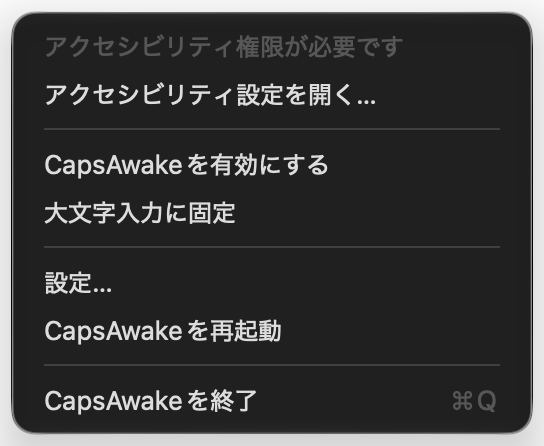

# CapsAwake

[日本語](README.ja.md)

[](https://github.com/gajeroll/capsawake/actions/workflows/ci.yml)
[](LICENSE)

CapsAwake is a macOS menu bar app that turns **Caps Lock** into a physical keep-awake switch. When Caps Lock is on, system sleep is disabled so local work can continue with the MacBook lid closed. When Caps Lock is off, normal sleep behavior returns.

Inspired by [Capsomnia](https://github.com/fuji-mak/Capsomnia) — an independent reimplementation with a different architecture (explicit state machine, XPC daemon, no sudoers file).

CapsAwake does not collect telemetry, make network requests, or require an account. Its interface is English and Japanese, following your system language unless configured in Settings.

It installs a background daemon that runs as root, because `pmset -a disablesleep` is the only public way to keep a Mac awake with the lid closed and no external display. [SECURITY.md](SECURITY.md) documents what that daemon executes, who can communicate with it, and what it writes.



## Requirements

- macOS 14 or later
- Apple Silicon (there is no Universal binary target and Intel Macs are not supported)
- Administrator approval when registering the privileged background daemon on first install

## Installation

1. Download the latest notarized archive (`CapsAwake-1.0.0.zip`) from [GitHub Releases](https://github.com/gajeroll/capsawake/releases).
2. Unzip the archive and move `CapsAwake.app` to `/Applications`.
3. Open `CapsAwake.app`. On first launch, approve the background daemon in **System Settings → General → Login Items & Extensions**.

> Note: Installation via Homebrew is not yet available.

## Build from source

```sh
git clone https://github.com/gajeroll/capsawake.git
cd capsawake
make build
make test
SKIP_SIGNING=true ./scripts/build-app.sh ~/Applications/CapsAwake.app
open ~/Applications/CapsAwake.app
```

Building from source requires macOS 14 or later and Swift 6.2 (Xcode 26). `xcstringstool`, which compiles the localizations, comes with Xcode rather than with the Command Line Tools.

> **A build from source cannot prevent sleep.** Disabling sleep requires the background daemon, and launchd enforces the launch constraint recorded during registration — which requires a notarized Developer ID binary. The app interface and key monitoring work, but changing the sleep setting will fail. Testing sleep prevention requires a `make notarize` build or an official [release](https://github.com/gajeroll/capsawake/releases). See [CONTRIBUTING.md](CONTRIBUTING.md#trying-out-sleep-prevention).

An ad-hoc signature (`SKIP_SIGNING=true`) pins the app's identity to its code hash, causing macOS to drop the Accessibility grant on every rebuild. Signing with an `Apple Development` identity or a self-signed `CapsAwake Dev` certificate in Keychain Access keys the identity to the bundle identifier and certificate instead, preserving the grant across builds:

```sh
SKIP_SIGNING=true SIGNING_IDENTITY="Apple Development" ./scripts/build-app.sh ~/Applications/CapsAwake.app
```

### Code signing and Team ID

Official releases are signed by Apple Team ID `H9DPAP9M7B` (`AppIdentity.teamIdentifier`). However, a running app and daemon do not trust a hardcoded constant. Instead, they build mutual XPC code-signing requirements dynamically from the Team ID in their own code signature (`SelfSigningTeam` in `Sources/CapsAwakeSystem/SelfSigningTeam.swift`).

A fork signed with another Apple Development or Developer ID certificate works without editing source code. An ad-hoc signature (`SKIP_SIGNING=true` or identity `-`) contains no Team ID and fails closed: the daemon accepts no clients and the app refuses connections to the daemon, logging an error to the unified system log. There is no `#if DEBUG` bypass.

## Permissions

| Permission | When needed | Why |
|---|---|---|
| Background daemon (root) | Always for sleep control | Applies `pmset disablesleep` on your behalf |
| Accessibility | Only if Caps Lock is given to CapsAwake | Installs a local event filter that strips Caps Lock from key events; nothing is logged or sent off-device |

The daemon runs as `CapsAwakeDaemon` inside the app bundle and is registered with `SMAppService`. When the last client disconnects, the daemon restores the previous `SleepDisabled` value after a short grace period; a boot-time reconcile does the same if no client reconnects within two minutes. Complete security details are documented in [SECURITY.md](SECURITY.md).

Deleting the app bundle does not fully uninstall CapsAwake: registering the daemon leaves a record in Background Task Management that outlives the bundle. Run [`scripts/uninstall.sh`](scripts/uninstall.sh) to quit the app, restore your system settings, unregister the daemon, and remove state kept under `/Library/Application Support/CapsAwake/`.

At launch, CapsAwake checks the Caps Lock LED state and treats a lit LED as the switch being on, then verifies `SleepDisabled` and clears any orphaned `true` state left by a previous crash.

Registering the daemon requires approval once in System Settings under **General → Login Items & Extensions**. Until approved, sleep settings cannot be changed; the menu bar icon shows a warning and the menu provides **Open Login Items Settings…**. CapsAwake polls every few seconds, updating automatically once approved.

macOS grants Accessibility permissions out of band. CapsAwake prompts once per launch and polls until permission is granted — no app relaunch is required. If permission is missing, the menu bar icon shows a warning and provides **Open Accessibility Settings…** (or sends a notification if the menu bar icon is hidden).

Toggling Caps Lock works without Accessibility permissions because CapsAwake reads hardware lock state directly. Accessibility is only required when assigning Caps Lock entirely to CapsAwake. Without Accessibility, this mode fails closed: CapsAwake refuses to prevent sleep rather than allow accidental uppercase typing.

## Energy Mode

While sleep prevention is active, CapsAwake switches the Mac's Energy Mode and restores the previous mode when disabled, quit, or after a crash. It defaults to **Low Power**.

macOS stores Energy Mode per power source (battery vs. power adapter). Both sources share one setting in CapsAwake unless separated in Settings. The original value for each source is recorded on disk so neither is lost. Automatic is supported, as well as High Power on supported Macs (marked **not recommended** due to additional heat and power consumption). Macs without Energy Mode support do not show this section.

You can disable Energy Mode switching in **Settings → Energy Mode**.

## Interface

The user interface is built with SwiftUI `MenuBarExtra` and a standard Settings window (⌘,).

Settings contains sections ordered by usage: CapsAwake, Caps Lock, Lid and Display, How far to keep awake, Energy Mode, General, Permissions, and Advanced. The main switch displays a ⇪ shortcut hint. The menu bar menu contains immediate controls — switches, **Settings…**, **Restart CapsAwake**, **Quit** — and warning rows when action is required. Both surfaces read from the same state store.

When a permission is missing, a **Needs attention** section appears at the top of Settings with direct action buttons. The standard Permissions section remains at a fixed position near the bottom so its location is predictable, providing links to System Settings regardless of grant status.

The switches reflect real-time keyboard state rather than launch preferences. **Lock to capitals** toggles uppercase typing directly via mouse interaction or the configured modifier combination.

Caps Lock behavior is configured in **Settings → Caps Lock**:
- **Give Caps Lock to CapsAwake**: Intercepts Caps Lock key events, freeing uppercase typing to be controlled independently and requiring Accessibility permission.
- When disabled, Caps Lock functions normally: a single press toggles uppercase typing and CapsAwake sleep prevention simultaneously. In this mode, **Lock to capitals** is hidden.

## Two switches on one key

When Caps Lock is given to CapsAwake, Caps Lock controls sleep prevention while **⇧⇪** (Shift+Caps Lock) toggles standard uppercase typing. The two operations are independent: the combination never alters sleep prevention, and pressing Caps Lock alone never alters uppercase state.

The modifier combination can be customized in **Settings → Caps Lock** by pressing the desired keys (any combination of ⌃, ⌥, ⇧, ⌘ with Caps Lock). Recording keys works without Accessibility permissions.

The modifier combination must match exactly to avoid ambiguous key behavior. Clearing the combination leaves Caps Lock exclusively as the CapsAwake switch, while uppercase typing can still be toggled from Settings or the menu bar menu.

The keyboard LED indicates sleep prevention status exclusively. Uppercase typing is applied by the event filter injecting Caps Lock modifier flags into passing key events, while the hardware LED state is maintained according to sleep prevention.

Because hardware lock state reflects sleep prevention, the filter prevents accidental uppercase typing. In environments the filter cannot reach (lock screen, Fast User Switching, or secure password fields), CapsAwake turns off the hardware lock and restores it when the active session returns. Sleep prevention remains active throughout.

If you prefer Windows-style Caps Lock behavior where Shift cancels uppercase typing, enable **Settings → Caps Lock → Shift types the small letter**. The filter modifies the key event directly to output lowercase characters while preserving modifier keys for input method engines (IMEs) and shortcuts.

The menu bar icon indicates both states independently:
- Green outline: sleep prevention on, capitals off
- Solid glyph: capitals on, sleep prevention off
- Green solid: sleep prevention on, capitals on
- Outlined glyph: both off

## The delay in front of the key

macOS ignores Caps Lock presses shorter than the keyboard's `CapsLockDelay` (typically 75 ms). CapsAwake overrides this delay to zero on launch so fast taps are not swallowed, and restores the original system value on quit. This setting can be managed in **Settings → Caps Lock**.

If the menu bar icon is hidden, launching CapsAwake again from Finder opens Settings.

## Lid close vs clamshell mode

macOS clamshell mode keeps a Mac awake when the lid is closed **and** an external display and power are connected.

CapsAwake disables lid-close sleep even without an external display. When the lid is closed without external screens, CapsAwake issues display sleep requests to keep screens dark while tasks continue running. When an external display is connected, standard clamshell behavior is preserved.

If another application holds a display sleep assertion, CapsAwake retries with backoff and posts a notification identifying the blocking process when possible.

## Safety

- Disables sleep prevention on critical thermal pressure, serious thermal pressure with lid closed, or when battery reaches the threshold configured in **Settings → How far to keep awake** (default: 5%).
- Optional sleep timer synchronization: allows sleep when the system idle timer expires and displays are dark.
- Verifies `SleepDisabled` against `IOPMrootDomain` every five seconds while active, and reapplies it if modified externally.
- Records original `SleepDisabled` and Energy Mode values to `/Library/Application Support/CapsAwake/baseline.plist` before changes, ensuring baselines survive daemon restarts and crashes.
- Avoid running multiple sleep-prevention utilities simultaneously.

## Troubleshooting

- **Daemon approval**: If sleep prevention fails to activate, open **System Settings → General → Login Items & Extensions** and verify `CapsAwakeDaemon` is enabled.
- **Accessibility grant reset on ad-hoc builds**: macOS invalidates Accessibility grants whenever an ad-hoc signed binary is modified. Sign with an `Apple Development` certificate or re-grant permissions in **System Settings → Privacy & Security → Accessibility**.
- **Gatekeeper first launch**: If macOS blocks opening a downloaded build, right-click (or Control-click) `CapsAwake.app` in Finder and select **Open**.
- **Ad-hoc signatures and root daemon**: An ad-hoc binary (`SKIP_SIGNING=true`) cannot communicate with the root daemon because launchd and XPC require valid code-signing identities. Use a developer identity or notarized release to test sleep prevention.

## License

MIT — see [LICENSE](LICENSE).
